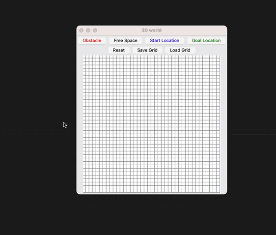

# Simple UI Global Planning

This is a simple UI which could be used to create inputs for the global-path-planners. Run the following command to run this tool:

```python
python3 2d-grid-ui.py
```

> NOTE: Tcl/Tk must be installed in your system for this to work

## Demo


